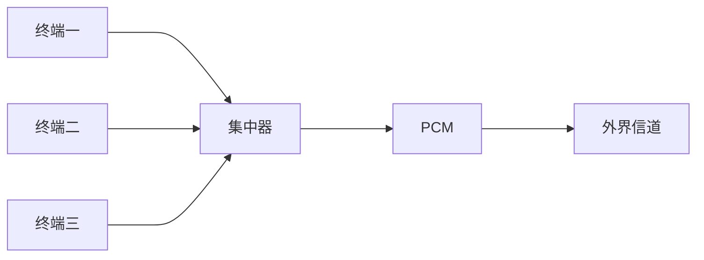
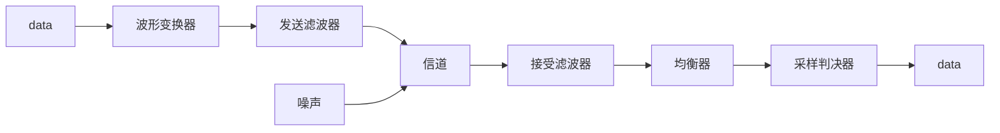

注:支持的markdown语法不齐全,网页阅读体验差

[toc]
# 数据通信系统

数据通过`数据链路`,在`传输信道`上传输
数据链路:

传输控制器:传输控制
信道:
```math
C=Blog2(1+S/N)   
```
```math
C=2Blog2M
```

# 数字数据传输信道(PCM)


# 多路复用
## 频分复用
调制解调
串扰:各路信号之间的干扰
## 时分复用
比特交织 or 字符交织
码间串扰,信道利用率低

# 数据序列的电信号表达
## 单极性不归零信号
## 单极性归零信号
## 双极性不归零信号
## 双极性归零信号
## 差分信号
变为1,不变为0

# 基带传输系统
不搬移基带信号频谱直接传输

## 奈奎斯特第一准则
具有理想低通特性,截止频率为f时,采样频率至少为`2f`,此时不产生码间串扰
```math
Bmax = 2W(band)
```
```
假设有一个模拟信号，它的最高频率成分是 4 kHz。按照奈奎斯特第一准则，为了准确地采样和重建这个信号，我们需要以至少 >= 8 kHz（2 * 4 kHz）的采样频率进行采样。
```
```
假设我们有一个带宽为 1 kHz 的信道。根据奈奎斯特第一准则，为了避免码间串扰，我们的码元传输速率应该是带宽的两倍，即 >= 2 kHz。

现在，我们考虑每个码元代表一个二进制位。如果我们以 2 kHz 的速率传输，每个码元的持续时间为 1/2 kHz = 0.5 毫秒。这意味着在每个 0.5 毫秒的时间内，我们可以传输一个二进制位。
```
## 奈奎斯特第二准则
有控制地在某些码元的抽样时刻引入码间干扰，而在其余码元的抽样时刻无码间干扰，就能使频带利用率达到理论上的最大值，同时又可降低对定时精度的要求

`总的来说,奈奎斯特的总的准则体现为`
```math
C=Blog2(1+S/N)   
```
```math
C=2Blog2M
```

# 扰乱和解扰
example:
输入X=abcdefg,Y=(1 ⊕ $D^M$)X
X=abcdefg
$D^M$X=00...00abcdefg   `M个0`
Y=X ⊕ $D^M$X

# 频带传输系统
调制解调,调制乘载波,解调再乘载波,解调之后采样的即为原始波形(不考虑噪声)

```math
e(t)=s(t)*coswt
```

## 正交调制
```math
e(t)=s(t)*coswt+s(t)*cos(wt+pi/2)
```

# 差错控制
信息码(k)+监督吗(r)=码组(n)
## 4种方式
1. 检错重发
   1. 停发等候重发:确认后发下一个
   2. 返回重发:重发错误之后的已经发送的所有
   3. 选择重发:发错误的那一个
2. 前向纠错
3. 混合检错纠错
4. 信息反馈

## 汉明码距
汉明码距为$d_m$,能检e<=$d_m$-1个错,纠($d_m$-1)/2个错
## 二维奇偶校验码
## 汉明码
## 循环码

# 差错控制
1. 停止等待(等待确认,超时,重发)
2. 自动重发
   1. 连续ARQ(错误,超时,重发所有已经发送的)  只有发送端需要缓存
   2. 选择重发ARQ(只重发错误的)  双方都需要缓存

# 数据交换
1. 电路交换
2. 报文交换(相比于分组,传输的是整个数据包)
3. 分组交换
   1. 数据报
   2. 虚电路
4. 帧中继
5. ATM交换
cell(信元)固定长度,所以非常快

# HDLC
| 标志字段 | 地址字段 | 控制字段 | 信息字段 | 校验字段  | 标志字段 |
| -------- | -------- | -------- | -------- | --------- | -------- |
| 01111110 |          | ISU      |          | FCS       | 0111110  |
| 8 bit    | 8~16 bit | 8~16 bit | 8n bit   | 16~32 bit | 8 bit    |

|               | 1   | 2    | 3   | 4   | 5/9 | 6/10... |
| ------------- | --- | ---- | --- | --- | --- | ------- |
| 信息帧(I帧)   | 0   | N(S) | <-  | <-  | P/F | N(R)    |
| 监控帧(S帧)   | 1   | 0    | S   | <-  | P/F | N(R)    |
| 无编号帧(U帧) | 0   | 1    | M   | <-  | P/F | M       |

`N(S):发送端发送帧的编号`
`N(R):准备接受的对方的帧的编号,即对N(R)-1的确认`
`P/F:主站1表示授权次站传输,次站传输1时表示结束.总的来说,1表示开始和结束,过程中为0`


<!-- ```mermaid
graph LR

``` -->
## 功能:
1. 帧控制
2. 透明传输
3. 差错控制
4. 流量控制
5. 链路管理
6. 异常状态的恢复

# 滑动窗口

