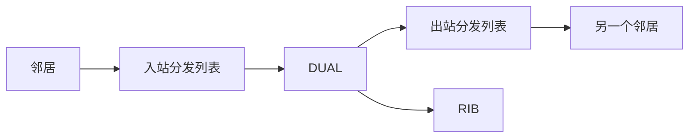
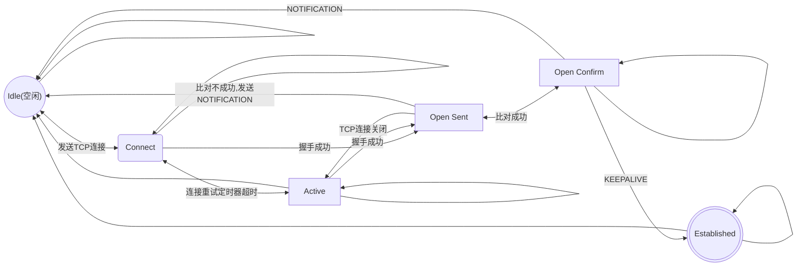
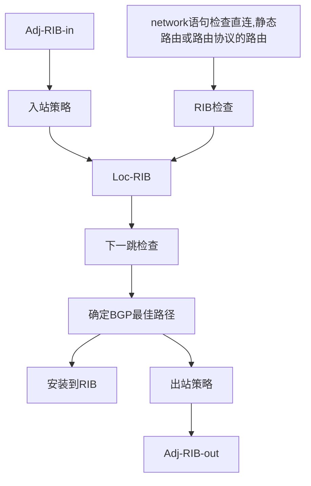
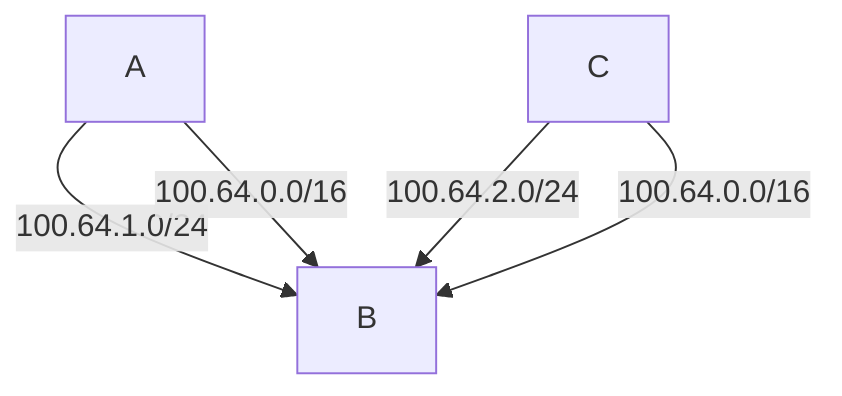

[TOC]

# TCP/IP and OSI
1. 应用层
   1. 应用层:HTTP,DNS等
   2. 表示层
   3. 会话层
2. 传输层-transport:TCP,UDP.提供一个基于ip的可靠传输协议TCP和努力交付的UDP
3. 网络层-network:IP.实现对数据来源去向的定位和路由
4. 数据链路
   1. 数据链路层:Ethernet,HDLC.实现对数据的基本的帧控制,差错校验等,使用MAC地址定位.
   2. 物理层:Ethernet.完成从物理设备模拟信号到数字信号的变换.
不同设备之间same-layer interaction(相同层交互),同一设备上adjacent-layer interaction(不同层交互).较底层为较高层提供服务,自底层向高层封装数据包,高层自底层解封数据包.数据段(segmen)对应传输层,数据包(packet)对应网络层,帧(frame)对应链路层.
## arp
连接网络层和数据链路层的协议,提供根据ip查询MAC地址的服务.
## 电缆引脚
相同:交叉电缆
不同:直连电缆

| 1,2    | 3,6    |
| ------ | ------ |
| PC网卡 | 集线器 |
| 路由器 | 交换机 |
| AP     |        |
# CLI相关
IOS的命令行界面称为CLI.CLI有三种模式,用户模式,EXEC(也叫特权)模式,配置模式(分为很多种不同的配置模式),接口模式(配置模式的一种,但我觉得比较特别).刚进入时,为用户模式,使用enable指令进入EXEC模式,EXEC模式通常是使用各种show命令查看设备信息.EXEC模式下使用configure terminal进入全局配置模式,全局配置模式下可使用各种配置命令进入不同的子项配置模式,也可以使用interface指令单独配置某一接口,使用interface range `interface` `num1`/`num2` `num3`进入更多接口.在配置模式中要使用show命令可以使用do show

交换机有三种连接方式,console口,Telnet和ssh.Telnet明文传输信息,不安全.要想使用ssh连接,需要给设备配置ip地址,一般在vlan接口处配置,也可以使用DHCP自动获取.
## 配置密码
配置模式(默认全局配置模式):
- 共享密码
  1. enable secret `password-value`(!特权模式密码)
  2. line console 0
  3. password `password-value2`(!console线密码)
  4. login
  5. exit
  6. line vty 0 15(!编号0-15)(!进入vty线路模式)
  7. password `password-value3`(!telnet登入密码)
  8. login
- 用户名密码对
  1. username `name` secret `password`
  2. line con 0
  3. login loacl
  4. (!可选)no password(!删除共享密码)
  5. exit
  6. line vty 0 15
  7. login local
  8. (!可选)no password(!删除共享密码)

## 配置ssh
配置模式:
1. hostname `name`
2. ip domain-name `domain-name`
3. crypto key generate rsa {modulus `modulus`|}(!生成rsa公私钥)(!sshv2至少需要768位密钥)
4. (!可选)ip ssh version 2

(!可选)vty模式:
- transport input {all|none(!默认值)|telnet|ssh}

## 其他命令
配置模式:
- write(!保存配置)
- save(!GNS3中vpc保存配置)
接口模式:
duplex {half|full}(!半双工或全双工)
no switchport(!切换为路由器端口模式)
## aaa
aaa服务器会集中保护交换机和路由器的用户名/密码对,aaa服务器可以是一个或多个服务器组成的服务器,aaa服务器会对启用了802.1x的认证方传来的消息认证,一般交换机充当认证方,终端充当请求方,认证成功交换机就不会过滤这个端口的消息了,认证不成功请求方可以重试.用户请求通过EAPoL传输到交换机,交换机发送RAIDIUS或TACACS+到aaa服务器.TACACS+功能更强大,会对消息进行加密,和对不同用户分别授予不同权限,是Cisco定义的,RADIUS是公开的.

CCNA考试只要求能够描述.

如果使用aaa,802.1x需要在局域网的所有设备上开启,使用EAP(类似UDP)进行通信.802.1x一般需要在连接终端用户的接口上启用.
### aaa配置
配置模式:
1. aaa new-model
2. tacacs server `server-name`
3. address ipv4 `address`
4. key `key`
5. port `port`
6. aaa authentication default `method1` `method2`(!medthod={`group-name|server-name`|local(!本地用户名认证)|login(!密码认证)})
## log
日志消息默认发送给通过console方式连接的用户,日志有不同的严重等级,0~7严重  等级依次递减.等级7代表debug消息.debug是和show类似的有大量可选项的命令,但很消耗计算资源,在实际生产中小心或避免使用.
### 配置
配置模式:
- logging monitor(!在IOS中启用向终端发送日志的功能)
- terminal monitor EXEC(!终端中使用表示希望接收日志)
## NTP
网络设备需要使用NTP(网络时间协议)来进行时钟的同步,NTP协议中,设备分为服务端和客户端,客户端接收服务端的时钟信息并修改自身时钟,设备可以同时充当服务端和客户端.存在多个服务端时,优先级级别低者优先设备时间设置为接近的时间,再进行NTP的配置,效果更好.
### 配置
- 时间
   配置模式:
  - clock timezone EST(!可以是任何值,但最好有意义.EST美国东部时间) `offset`(!常数,意为相比UTC(!世界协调时)多offset小时,可以为负数)
  - clock summer-time EDT(同EST) recurring

   EXEC:
  - clock set 20:59:49(!时:分:秒) October(!月) 2020(!年)
- NTP
   配置模式:
  - (!客户端)ntp server {`ip`|`hostname`}
  - (!服务端)ntp master `priority`(!越低越优先)
  - (!可选)ntp source `interface`(!指定NTP服务器用于发送和接收NTP时间同步信息的网络接口,最好使用环回接口)
### 环回接口
环回接口不是ip地址中的127.0.0.1环回接口,是IOS中可以创建的虚拟接口,可以分配ip并被路由,并且总是up/up状态,不能shutdown.
#### 配置
配置模式:
- interface loopback `num`(!任意整数)
- (!之后可以和普通接口一样进行配置)


# IPv4 and IPv6

1. **路由信息源**：
   路由信息源指的是路由信息的来源，可以包括直接连接的网络、静态路由配置、或是各种动态路由协议（如OSPF、BGP、EIGRP等）收 集的路由信息。这些信息源提供了网络中可达性信息的原始数据。

2. **RIB（Routing Information Base，路由信息库）**：
   RIB是路由器内部用来存储路由信息的数据库，它包含了从各种路由信息源收集来的所有路由信息。RIB中的信息包括目的网络、下一 跳地址、路由的成本（如跳数、带宽等）以及路由的其他属性。路由器会根据预设的路由选择协议（如最短路径优先、路径成本最低等）从RIB中选择最优的路由信息用于构建FIB。

3. **FIB（Forwarding Information Base，转发信息库）**：
   FIB是基于RIB选出的最优路由构建的，用于实际的数据包转发。FIB通常只包含用于数据包转发决策的必要信息，如目的IP地址范围、下一跳地址和出接口。FIB是高效的，优化了查找速度，以便快速处理经过路由器的数据包。

   FIB包括路由表,多播路由(例如ospf的hello消息),直连主机等信息.使用FIB会直接使用邻接表构建帧头.

4. **路由表**：
   通常情况下，"路由表"这个术语可以指RIB或者是FIB，具体取决于上下文。在许多文档和命令行界面中，当我们查看“路由表”时，通 常是在查看RIB，它展示了路由器知道的所有路由信息。而FIB有时被称为“转发表”或者直接是“FIB”。


ip地址用于定位,通过路由实现.路由是查找路由表,最长前缀优先的过程.

在转发查询mac地址时,查询路由表和arp缓存比较低效,cisco的CEF(cisco Express Forwarding)提供了FIB和邻接表加速此过程.

## AD(Administrative Distance)
路由器可以从路由协议,静态路由,直连路由中接收信息填充路由表,各种协议和信息之间有优先级的差别,称为AD(管理距离).
 <span id="AD-TABLE"></span>
| 信息源      | AD  |
| ----------- | --- |
| 直连        | 0   |
| 静态        | 1   |
| EIGRP汇总   | 5   |
| eBGP        | 20  |
| EIGRP(内部) | 90  |
| OSPF        | 110 |
| IS-IS       | 115 |
| RIP         | 120 |
| ODR???      | 160 |
| EIGRP(外部) | 170 |
| IBGP        | 200 |
| 未知        | 255 |

## ip地址
无子网掩码时使用网络类别,不然ip地址&子网掩码为子网网络地址.
### 网络类别
- A:0.0.0.0 到 127.255.255.255 (0.0.0.0 用于表示当前主机，而 127.0.0.0 子网是用于本地回环测试的回环地址).10.0.0.0子网作为私有地址
- B:128.0.0.0 到 191.255.255.255, 172.16.0.0 ~ 172.31.0.0作为私有地址
- C:192.0.0.0 到 223.255.255.255, 192.168.0.0 ~ 192.168.255.255作为私有地址
## 子网掩码
在同一个子网中,为不同网段使用不同掩码称为VLSM(变长子网掩码),计算是否有重叠只需计算子网广播地址是否有重叠即可.为一个子网添加一个VLSM子网,需要列出可能的子网和其广播地址,然后计算已经存在的子网和其广播地址,查看是否有冲突.格式有三种:二进制,DDN(点分十进制),CIDR(前缀)

魔法数字=256-非255非0掩码
子网ID:魔法数字倍数中最接近并小于等于IP地址的一项(从0开始)
子网广播地址:子网ID+魔法数字-1

| mod8 | 0   | 1   | 2   | 3   | 4   | 5   | 6   | 7   |
| ---- | --- | --- | --- | --- | --- | --- | --- | --- |
| DDN  | 255 | 128 | 192 | 224 | 240 | 248 | 252 | 254 |
### 配置
配置模式:
- ip route `destination-address` `destination-maslk` {`inter`|`ip`}(!静态端口目的地址为以太网时,不要使用接口,因为为频繁使用arp查询mac地址导致性能降低)
接口模式:
- ip address `address` `mask`

## IPv6
- icmp升级为icmpv6,NDP(邻居发现协议)(Neighbor Discovery Protocol)代替ARP.
  NDP有发现路由器,发现地址信息.路由器会被要求(RS)通告(RA)自己的信息,主机通过这两种消息获取路由器信息;NS(邻居请求)和NA(邻居通告)如同arp,要求某个ipv6主机回答MAC地址,并且可以利用其检查出重复地址,这个过程叫DAD.
- 主要是ipv6的缩写形式./64是默认的前缀.
- 动态获取地址的方式除了DHCPv6之外多了SLAAC.
  当一台主机使用SLAAC时,它需要使用NDP RS/RA消息从路由器获知ipv6前缀,然后使用EUI-64或随机生成后缀,再使用DAD确保这个地址没有被使用.NDP提供了地址前缀,前缀长度,和默认路由器的信息,最后使用无状态DHCPv6提供DNS服务器即完成了主机的网络设置.
- 路由器不是默认开启ipv6的,需要手动开启.
- 多了任播地址,几台执行相同功能的设备可以使用相同的ipv6地址.路由器只需选择离自己最近的.


| 地址类型 | 前几位16进制数 |
| -------- | -------------- |
| 全局单播 | 2或3           |
| 本地唯一 | FD             |
| 多播     | EF             |
| 本地链路 | FE80           |
### eui-64
1. 左24位mac:fffe:右24位mac
2. 对第7位取反(第二个数能减8减8,能减4减4,之后大于等于2的减2,不然加2)
3. 都以fe80开头
例如:
MAC:08-00-27-5D-06-D6
ipv6:fe80:0a00:27ff:fe5d:6d6
### 配置
配置模式:
- ipv6 unicast-routing(!启用ipv6路由)
接口模式:
- ipv6 address `address`/`prefix-length`
- ipv6 address `前缀`(!2001:db8:a:a::/64) eui-64(!使用eui-64自动生成主机地址)
- ipv6 address autoconfig(!启用SLAAC)

## DHCP
DHCP(dynamic host configuration protocol 动态主机配置协议)是用于自动配置ip,掩码,网关,dns的协议.DHCP设备分为3中,客户端,中继端和服务端.建议DHCP采用集中式设计,需要DHCP服务器的子网使用中继,更好控制和配置所能分配的ip地址.由于路由本身就需要知道各个网络该如何去,所以dhcp自动分配ip地址虽然有服务器功能,但设计还是仔细考虑各个子网的ip池,即子网划分.

客户端使用0.0.0.0作为源ip地址,255.255.255.255发送Discover(发现)消息,服务端会回复一个Offer(提供)消息通告可以分配的地址和其他参数.客户端收到Offer后会发送Request(请求)消息请求ip地址,如果能够分配,服务端会回复Acknowledge(确认)消息,分配ip,掩码,默认路由器,dns等.

中继会不断接收客户端信息并将源ip改为自己的ip,路由数据包到服务端.

服务端有三种分配模式,动态分配(可用ip作为一个池,不断租用ip给客户端),自动分配(租用时间为无限)和静态分配(根据mac地址分配ip,已被分配ip不会再被分配).

### ipv6
在ipv6中,DHCP升级为DHCPv6,不再为主机通告默认路由器,默认路由器由主机使用NDP协议发现.
### 配置
- 中继
  接口模式:
  1. ip helper-address `server-ip`(!在连接主机的接口上)
- 服务端
   配置模式:
   1. ip dhcp excluded-address `first` `last`(!排除掉的地址,必须排除掉路由器接口已占有的那些地址)
   2. ip dhcp pool `name`(!进入dhcp池配置模式)
   3. network `subnet-ip` {`mask`|`prefix-length`}(!池中子网)
   4. default-router `address1` `address2`(!默认路由器)
   5. dns-server `address1` `address2`(!默认dns服务器)
   <!-- 6. (!可选)lease `days` `hours` `minutes`(设置ip租期)
   7. (!可选)domain-name `name`
   8. (!可选)nest-server `ipaddress`(TFTP服务器地址) -->

### 排错
1. 由于discover消息是广播的,所以dhcp服务器和主机应当在同一子网,不然就要使用中继,中继要与dhcp服务器同一子网
2. 地址池耗尽
3. dhcp服务器冗余设置时,互相之间要能通信(???)
4. 使用show ip dhcp conflict显示重复ip,然后使用clear ip dhcp conflict *清除分配记录
5. 使用show ip dhcp binding显示分配情况,clear ip dhcp binding *清除分配情况
6. debug ip dhcp server {events|packets}
### DHCP snooping
DHCP有可能会被欺骗攻击,可以使用DHCP snooping.会将信任端口(手动配置)的所有dhcp消息放行,不信任(终端)端口的DHCP服务器消息(OFFER和ACK)过滤,客户端消息经过DHCP绑定表判定,判定成功继续填充表.
#### 配置
配置模式:
1. ip dhcp snooping
2. 
## NAT
私有地址在网络中不被路由,无法定位.使用NAT技术,可以在子网内使用私有地址定位,需要连接到Internet时,将私有地址转换为可路由的单播地址.具体来说,是将ip数据报中的源修改为单播地址,PAT还会修改端口号,此时路由器还需要记住这个映射关系.思科将这个私有地址称为Inside Local(内部本地),这个单播地址称为Inside Global(内部全局).当内部全局地址耗尽时,路由器会丢弃无法进行地址转换的包.ACL会在转换前匹配.

NAT分为三种,静态NAT,动态NAT和PAT(NAT重载).

静态NAT只是单纯的为内部本地地址和内部全局地址做了映射,并且每一个映射需要手动配置.

动态NAT有一个可使用的内部全局地址池,自动完成内部本地到全局的映射,设置有分配超时时间.比静态映射稍微好一点点,所需要的内部全局地址数约等于内部本地同时访问Internet的数量.

PAT基于TCP和UDP有65535个端口,其中真正被使用的很少,所以可以通过对ip+端口同时建立动态映射来达到少量内部全局地址支持大量内部本地地址同时访问Internet.

### 配置
接口模式(设置nat内部和外部接口,所有NAT都需要):
  - ip nat inside
  - ip nat outside 
- 静态NAT
   - ip nat inside source static `inside-local` `inside-golbal`
- 动态NAT
  - ip nat pool `pool-name` `first-address` `last-address` netmask `submask-mask`
  - ip nat inside source list `acl-number` pool `pool-name`
- PAT
  - ip nat inside source list `acl-number` {pool `pool-name`|interface `type/number` overload}
## IGP(RIPv2, OSPF, EIGRP) and EGP(eBGP) 
路由器之间学习路由,通告路由,选择路由,收敛路由的协议.静态路由和直连路由的信息不会用于更新路由协议的数据结构,只有邻居消息,入站路由信息,重分发路由信息会.

路由协议分为内部网关协议(IGP,适用于自洽系统(AS)内部)和外部网关协议(EGP,适用于不同自洽系统之间)
对于IGP,路由协议算法分为三大类:
- 距离矢量型(例如:RIP的跳数)
- 高级距离矢量型(EIGRP)
- 链路状态型(OSPF)

对于EGP,BGP是不二之选了.

### RIPv2
RIP使用跳数作为衡量路由优劣的距离矢量,每经过一个路由器,跳数加1.RIP基于一个短时间定时器定期向邻居发送路由信息,路由信息会被拆分,只会发送路由表中目的接口对应的不是发送目的邻居的信息.当出现路由环回时,两个路由器不停交换路由,使跳数等于16时,该路由被弃用,称为路由中毒.
#### 配置
配置模式:
1. router rip
2. version 2
3. network `net-number`
4. (!可选)passive-interface(!被动模式,不发出路由更新消息)
5. (!可选)maximum-paths `number`(负载均衡)
6. default-information originate(RIP的默认路由通告)


### OSPF
每个使用OSPF的路由器有自己的LSDB(链路状态数据库),里面保存了包含了链路状态和链路度量的LSA,LSA有7种类型.路由器需要将自己创建的LSA泛洪给OSPF邻居,直到同一区域内每台路由器的LSDB完全相同.每一台路由器使用Dijkstra SPF(shortest path first)算法处理LSDB,生成SPT(SPF Tree),视自己为根节点,得到去往每一个节点的最短路径,创建条目添加到路由表.

OSPF使用协议ID 84 .有224.0.0.5,224.0.0.6或MAC地址01:00:5E:00:00:05,01:00:5E:00:00:06作为多播地址.

OSPF RID优先环回接口ip最大,其次Up物理接口ip最大,可以手动设置.


#### OSPF区域
OSFPF将拓扑结构网段分为多个OSPF区域,OSPF只会在OSPF区域内生效(一般来说,一个区域内路由器数量<=50).Area 0称为骨干区域,所有区域(包括普通区域和骨干区域)都必须直接或间接地连接到骨干区域(Area 0),同时连接Area 0和其他区域的路由器称为ABR,将路由重分发进OSPF域的路由器称为ASBR.骨干区域(area 0)内部的路由信息会在整个骨干区域中洪泛,这意味着骨干区域内的所有路由器都会收到来自其他路由器的路由更新.
- 所有同子网的接口在同一区域
- 区域内连续

当区域应该连续但没有时,可以将需要连接的部分使用虚链路连接,但只是临时解决方案.

#### OSPF邻居
OSPF有5种数据包,1. Hello 2. DBD或DDP(DataBase Description) 3.LSR(Link-State Request) 4. LSU(Link-State Update,响应LSR) 5. 确认(Link-State Acknowledgment,响应洪范的LSA)

OSPF邻居条件:
1. RID不同
2. 同一子网
3. MTU相同
4. 在同一网段内,区域ID相同
5. 在同一网段内,DR的需求相同(网段网络类型相同)
6. 在同一网段内,OSPF Hello和失效定时器相等
7. 在同一网段内,认证相同
8. 在同一网段内,路由器类型相同(末梢,非完全末梢)

OSPF邻居状态.
1. Down:未收到hello包 
2. Attempt:发送但未接受到Hello
3. Init:收到Hello包,但Hello包中没有RID
4. 2-Way:已经建立双向通信,以太网的DROther的最终状态
5. ExSatrt:为LSDB选择主从设备
6. Exchange:发送DBD 
7. Loading:发送LSR 
8. Full:完全邻居状态.(Down和Attempt状态应该只有显式配置邻居才会出现)

OSPF有三个定时器
1. hello 
2. 等待 
3. 失效

默认失效是Hello的4倍.失效时间内一直未收到邻居Hello则邻居状态变为Down.并且修改并发出LSA,区域内路由器执行SPF.

#### LSDB
对于IPv4,有 ***6*** 种不同的LSA:
1. Type 1 Router Links(路由器LSA):只在一个区域内泛洪,包含自身在同一区域内的每个接口的网段信息,如果是ABR,ASBR,或虚链路端点,也会标记.
2. Type 2 Networks Links(网络LSA):DR宣告多路接入网段的信息,也只在一个区域内
3. Type 3 Summary Links(network)(汇总LSA):ABR将收到的Type 1和Type 2汇总发往其他区域,此时度量为到达各网段的度量;收到area 0的Type 3,就自己生成一条新的Type 3,并且加上到宣告路由器度量给非骨干区域;而受到别的区域的Type 3,仅将其插入LSDB,不会生成新的Type 3.所以只会在骨干与非骨干之间交换.
4. Type 4 Summary Links(ASBR)(ASBR汇总LSA):ABR收到Type 5后,检查是否在自身网段,如果是,生成Type 4宣告用以定位ASBR;如果不是,收到Type 4时,会将宣告者改为自己,再宣告出去.很多Type 5也只会宣告1条Type 4.
5. Type 5 AS External Link(AS外部LSA):被重分发的外部路由.没有区域的概念,会在整个OSPF路由域内泛洪,度量值也不会变化.
6. Type 7 外部NSSA LSA:见NSSA.只有执行了重分发的NSSA存在Type 7.

Type 1 会被区域间路由汇总的ABR过滤.
Type 5或Type 7会被外部汇总的ABR过滤.

在没有多路接入的网段下,只需要Type 1 LSA就可以确认网络拓扑,有的情况下,需要Type 2 LSA.
#### 末梢区域
OSPF有4种末梢区域.末梢区域内所有路由器需要配置为末梢路由器. 
1. 末梢区域:区域内禁止Type 4和Type 5 LSA.Type 5到达末梢区域ABR后,ABR生成Type 3,如果ABR配置了area 0的接口,会生成Type 3默认路由.
   1. 没有被重分发的外部路由,被默认路由代替
2. 完全末梢区域:区域内禁止Type 3,4,5.ABR收到Type 3或Type 5,会生成一条默认路由.完全末梢区域只存在区域内路由和默认路由.
   1. 除了区域内路由,所有路由被默认路由代替
3. NSSA(Not So Stubby Area):禁止Type4,5.ASBR使用Type 7在NSSA内宣告重分发的路由,到达ABR时,ABR将其转为Type 5.ABR也禁止Type 5进入区域.ABR可以配置宣告默认路由.
   1. 没有被重分发的外部路由,被默认路由代替
   2. 允许OSPF域内有自己区域ASBR重分发的路由
4. 完全NSSA:禁止Type 3,4,5.区域内禁止路由重分发.ASBR宣告路由方式和NSSA相同.
   1. 除了区域内路由,所有路由被默认路由代替
   2. 允许OSPF域内有自己区域ASBR重分发的路由

#### SPF
路径优先级:
1. (单个)区域内路径
2. (不同)区域间路径:所有区域间路径必须经过area 0.
3. 外部Type 1:$度量=重分发度量值+到达ASBR度量值$,优于Type 2.
4. 外部Type 2$度量=重分发度量值$(默认外部度量类型)
(外部路由的Type和LSA的Type没有关系,都是Type 5或7 LSA.)

外部Type 1,2又分为E1,N1,E2,N2(E为ASBR宣告,N为NSSA宣告).N始终优于E,N会阻止E的安装.Type 1如果度量相同会被同时安装到RIB中,Type 2会比较到达宣告ASBR的转发开销.

计算SPF树时,网络链路有三种类型:
1. 转接:邻居邻接关系已经建立,并且选举了DR
2. 点对点:在不需要选举DR的网段上,已经建立了邻居邻接关系(会多宣告一条末梢网络提供子网掩码)
3. 末梢:未建立邻居邻接关系

#### DR
OSPF在以太网或帧中继等多路接入网络中,由于一个网段可以有大于二个路由器,OSPF会建立过多邻居邻接关系.所以OSPF中需要选择DR(Designated Router,指定路由器)和BDR(备用指定路由器).只有DR会和其他DROther(非DR非BDR的路由器)交换LSDB.

| 类型                          | 描述                       | 是否有DR/BDR | 定时器(hello:等待:失效) |
| ----------------------------- | -------------------------- | ------------ | ----------------------- |
| broadcast(广播)               | 以太网                     | 有           | 10:40:40                |
| non-broadcast(非广播)         | 帧中继                     | 有           | 30:120:120              |
| point-topoint(点到点)         | HDLC或PPP,GRE,点到点帧中继 | 无           | 10:40:40                |
| point-to-multipoint(点到多点) | 星形拓扑(帧中继和L2VPN???) | 无           | 30:120:120              |
| loopback(环回)                | 环回接口                   |

广播网像以太网,支持广播,NBMA(非广播)例如帧中继,x.25,atm可能同一个网段有多个路由,但不支持广播,所以hello消息只能单播,但又需要DR.

选举DR时,优先级越高越优先,但默认值都为1,优先级为0时不会参与选举,其次RID越高的越优先,修改优先级控制DR更优.OSPF RID当有显式配置时显式配置优先,其次是up的环回接口上的最高者,然后是up的普通接口上的最高者.

选举DR过程和STP选举根交换机类似,也是默认不抢占的.
1. 在Hello包中发出自己的优先级和RID.
2. 收到的Hello包更优则发送更优的优先级和RID.
3. 达成一致后和DR建立邻居邻接关系.
4. 同样方式选举BDR,但DR不参与


#### 配置
配置模式:
1. router ospf `process-id`(ospf进程id)
2. (!RID) router-id `router-id`
3. network `ip-address` `wildcard-mask` area `area-id`(!`wildcard-mask`:例如255.255.255.255,匹配所有接口,0.255.255.255,匹配所有ip第一位为`ip-address`第一位的接口,0.0.0.0精确匹配ip对应的接口)
4. (!宣告默认路由) default-information originate [always (!没有默认路由也宣告???)] [metric `metric-value`(!路由度量)] [metric-type `metric-type`(!路由度量类型)] (!通告静态路由)
5. (!带宽大于100M时,必须进行此设置)auto-cost reference-bandwidth 10000(!10000意味着带宽最大为10G(10000M)内正确计算开销值)
6. (!负载均衡)maximum-paths `number`
7. (!区域启用认证)area `area-id` authentication [message-digest]
8. (!末梢区域) area `area-id` stub [no-summary]
9. (!NSSA) area `area-id` nssa {[default-information-originate]|[no-summary]}
10. (!区域间路由汇总)area `area-id` range `network` `subnet-mask` [advertise(!默认)|non-advertise] [cost `metric`]
11. (!外部汇总)summary-address `network` `mask`
12. (!虚链路)area `area-id` virtual-link `end-point-RID`(!对端RID或区域ID)
13. (!被动接口)passive-interface {`type` `number`|default(!默认所有接口为passive)}

接口模式:

- (!接口启用认证)ip ospf authentication [message-digest]
- (!明文认证密码)ip ospf authentication-key `password`
- (!md5认证密码)ip ospf message-digest-key `key-number` md5 `password`
- ip ospf `process-id` area `area-id`[secondearies none(!不添加辅助直连网络到LSDB)] (!代替进程下的network指令)
- ip ospf cost `x`(!直接设置开销值)
- ip ospf network `type`(!设置网络类型,例如point-to-point将邻居关系建立在唯一的相邻路由器上，减少网络的控制消息和开销)
- (!DR优先级)ip ospf priority `0-255`(!要立即生效需要重启DR/BDR的ospf进程)
- (!定时器)ip ospf {hello-interval|dead-interval} `1-65535`


#### 排错
1. 邻居关系
没建立邻居关系通过show cdp neighbor
   1. 接口关闭
   2. 接口上未运行OSPF:
      1. show ip ospf interface brief(!不显示被动接口)
      2. show ip protocols
   3. 定时器:
      1. show ip ospf interface `interface-type` `number`(!查看自身)
      2. debug ip ospf hello(!查看邻居)
   4. 区域ID
      1. show ip ospf interface brief
      2. debug ip ospf adj
   5. 区域类型
      1. show ip protocols(!查看整个区域的数据统计)
      2. show ip ospf(!该路由器的详细信息)
      3. debug ip ospf hello
   6. 子网
   7. 被动接口
      1. show ip protocols
   8. 认证
      1. show ip ospf(!查看区域认证)
      2. show ip ospf interface `type` `num`(!查看接口认证和密钥ID)
      3. show run interface `type` `num`(!查看密钥字符串)
   9. ACL
      1. show ip ospf interface `type` `num`(!查看接口是否启用ACL)
      2. show access-list `num/name`(!查看具体ACL配置,注意末尾默认有deny all)
   10. MTU:不匹配会成功建立邻居关系,但会陷入ExStart/ExChange状态
       1. show run interface `type` `num`(!没有mtu配置则为默认1500)
       2. 可以在接口模式中使用ip ospf mtu-ignore
   11. RID重复
   12. 网络类型               
       1. show ip ospf interface `type` `num`
2. 路由
   1. 接口未运行OSPF
      1. show ip protocols
   2. 更优的路由:[AD表](#AD-TABLE)
   3. 路由过滤:OSPF的路由过滤控制的是LSDB中哪些路由进入路由表
      1. show ip protocols(!查看是否有,有哪个路由过滤器被应用)
      2. show ip {prefix-list `name`|access-list `name`|`num`|show route-map `name`}(!查看过滤器具体内容)
   4. 末梢区域
      1. show ip ospf
   5. 接口关闭
   6. DR选举错误:星形帧中继或DMVPN时,只能由中心点作DR
      1. show ip ospf interface `type` `num`(!查看Designated Router)
      2. show ip ospf interface brief(!查看哪些接口是否是DR)
   7. RID重复


#### ipv6
支持ipv4,ipv6双栈的ospf协议是ospfv3协议家族,与ospfv2不兼容.使用协议ID89.多播地址:FF02::05(ALLSPFRouters),FF02::06(ALLDRouters)
- SPT计算基于链路而不是子网
- 新LSA字段确定LSA泛洪范围和未知LSA类型的处理
- 删除邻居认证,改为使用IPsec(互联网络层安全协议)
- 使用ipv6链路本地地址.允许不共享子网的路由器建立邻居关系.
- 多实例
##### LSA
ospfv3相比v2的区域,自治系统多了链路本地的泛洪范围.
LSA Type字段由8bit扩充为16bit.
前3bit为U,S2,S1
| U   | LSA处理      |
| --- | ------------ |
| 0   | 链路本地处理 |
| 1   | 储存泛洪     |

| S2  | S1  | 泛洪范围 |
| --- | --- | -------- |
| 0   | 0   | 链路本地 |
| 0   | 1   | 区域     |
| 1   | 0   | 自治系统 |
| 1   | 1   | 保留     |

2:0010,4:0100

| LSA Function Code | LS Type | Description           | 范围     |
| ----------------- | ------- | --------------------- | -------- |
| 1                 | 0x2001  | Router LSA            | 区域     |
| 2                 | 0x2002  | Network LSA           | 区域     |
| 3                 | 0x2003  | Inter-Area Prefix LSA | 区域     |
| 4                 | 0x2004  | Inter-Area Router LSA | 区域     |
| 5                 | 0x4005  | AS-external LSA       | 自治系统 | <!-- | 6 | 0x2006 | Group Membership LSA | 区域 | --> |
| 7                 | 0x2007  | NSSA LSA              | 区域     |
| 8                 | 0x0008  | Link LSA              | 本地     |
| 9                 | 0x2009  | Intra-Area Prefix LSA | 区域     |


##### 配置
配置模式:
1. ipv6 unicast-routing
2. router ospfv3 `process-id`
3. (!RID) router-id `router-id`
4. (!被动接口)passive-interface {`type` `number`|default(!默认所有接口为passive)}
5. (!地址簇) address-family {ipv6|ipv4} unicast(!在使用该命令后,接口上的ospfv3会自动启用需要的地址簇???.进入AF配置模式,比在ospfv3进程下的配置具有更高优先级)
<!-- 5. (!认证)ospfv3 encryption {ip}??? -->

接口模式:
1. ospfv3 `process-id` ipv6 area `area-id`
2. (!可选) ipv6 ospf cost `x`
3. (!可选)ip ospf priority `num`

##### 排错
- show ipv6 protocols
  - PID
  - RID
  - 路由器类型(ABR,ASBR)
  - Area ID
  - 区域类型(末梢区域或NSSA?)
  - 接口及接口所属区域
- show ipv6 ospf
  - PID
  - RID
  - 路由器类型(ABR,ASBR)
  - 定时器
  - Area ID
  - 区域类型
  - 基准贷款
  - 认证
- show ipv6 ospf interface brief
  - 各接口PID
  - 各接口区域
  - 协议簇
  - DR/BDR
- show ipv6 ospf interface `type` `num`
  - 网络类型
  - 开销
  - 认证
  - 优先级
  - 定时器
  - DR ID或BDR ID
- show ipv6 ospf neighbor
  - 邻居ID
  - 邻居状态
  - 邻居接口ID
  - 对应的本地接口
### EIGRP
EIGRP会使用RTP建立邻居关系,维护邻居邻接表;建立邻居关系时和邻居交换整个路由表,之后更新增量,维护自身拓扑表,使用DUAL计算最佳路由,并且完成路由的收敛.

EIGRP使用IP协议ID88,组播地址224.0.0.10,mac地址01:00:5e:00:00:0a.
#### 1. 邻居关系

RTP之间有5种消息包 1. Hello 2. Request 3. Update 4. Query 5. Reply,接收到消息都需要发送ACK包响应,除了Hello和ACK.没有响应重传,16次重传无响应就会重置邻居关系.

有三个定时器:1. Hello 2. hold 3. active.在hold定时器时间范围内每hello定时器发送的hello包得到响应则保持邻居关系.activate见DUAL.

EIGRP区分不同路由器的ID称为RID(router id),EIGRP进程会尝试与另一个在**同一子网**下使用EIGRP的路由器建立邻居关系,需要**认证匹配**,,并且处于**同一自洽系统号**,然后使用名为RTP(可靠传输协议)的协议发送路由更新(整个路由表),一般来说,第一次是完整的路由更新,之后会是部分路由更新.同一自洽系统度量值**K 值**应该相同.

#### 2. 拓扑表
拓扑表包含网络前缀,EIGRP邻居,RD和跳数,度量相关(负载,可靠性,总时延,最小带宽).例如:
```IOS
P 10.12.1.0/24,1 successors, FD is 2816
   via Connected, GigabitEthernet0/3

或 via 10.14.1.4(5376/2616), GigabitEthernet0/2
```

- `P`代表Passive,表明结构稳定,不然为Active.
- `1 successors`表示到达该子网有一个后继路由,即后面的`via`条数.
- `10.14.1(5376/2616)`表示到10.14.1.4的Total Distance/Feasible Distance(RD)
- `GigabitEthernet0/2`是自己的接口


#### 3. 度量值

EIGRP的度量值使用链路的最小带宽和累计延迟做参数,最小带宽和延迟会由通告的消息和自身设备权衡后得出.IOS不会根据物理带宽去计算,所以广域网链路的带宽需要手动设置,局域网可以默认,效果比较好.

修改bandwidth会影响所有使用bandwidth的协议,修改delay只会影响EIGRP中的总时延项.

```math
度量=常数*[(K_1*\frac{10^7}{最小带宽}+\frac {\frac {10^7} {k_2*最小带宽} } {256-负载}+K_3*总时延+K_6*拓展属性)*\frac{K_5} {(K_4+可靠性)}]
```

当非宽度量模式时,$常数=256$,为宽度量时,$常数=65535$.当$K_1$,$K_3$为1,$K_2$,$K_4$,$K_5$,$K_6$为0时,满足

```math
度量=256*\frac {10^7} {最小带宽}+\frac {总时延} {10}
```


#### 4. DUAL
自身对某一特定子网的度量值叫做FD(可行距离),而可以到达该子网的邻居报告的其自身的FD称为RD,当RD小于FD时,报告RD的邻居即为该子网的可行后继路由.当没有可行后继时,会通过DUAL(弥散更新算法)查询那些不是可行后继路由的邻居是否可行.可行后继路由中FD最小的为后继路由,即装入路由表中中的路由.

*这个方法很巧妙,无论最简单的环还是复杂的环,其本质也是通过某个节点通过某种路径指向了自身,而FD相当于RD+自身,此处的+可以理解为加上了到自身端口的延迟和开销.*

当路由器发现某条链路出现故障时,有可行后继路由,选择度量值最小的作为后继路由,并向路由下游邻居发送新的度量值更新包,收到更新包的路由器也递归的执行自己的DUAL.
如果没有可行后继路由:
1. 拓扑表中的该路由将会变为主动状态
2. 受影响路由器会发送查询包给邻居,查询包是时延字段无穷大.
3. 
   1. 收到查询包,如果查询包来自(该查询包查询的路由)的后继路由邻居,那么说明(该查询包查询的路由)不可达,自身也会发送查询包给该路由下游邻居.
   2. 如果查询包不是来自被查询路由的后继,那么发送应答包,应答该路由不可达或可达路由.
4. 当收到自己发送的所有查询包对应的应答包时,完成DUAL,将路由变更为Passive状态.向上游发送应答.

当DUAL过程卡住超过Active计时器一半时间时,称为SIA(Stuck-in-Active),会向邻居发送SIA查询信息,邻居必须在Active计时器一半时间响应,否则视为邻居对来自该邻居的所有路由均返回不可达消息.

#### 路由汇总
路由汇总EIGRP会默认安装一条丢弃路由防止路由环回.

汇总度量使用的是被汇总路由中最低的度量值.

EIGRP自动汇总在IOS 15以前自动开启,会自动汇总有类网络.实际网络中,大多不使用.

#### 末梢路由器 and 末梢站点
当企业将路由器通过ISP接入互联网时,希望自己的路由器路由的是自己LAN中的流量,不会通过WAN口去进行路由,就需要设置末梢路由器或站点.

EIGRP末梢路由器不会宣告从其他EIGRP对等体学到的路由,默认仅宣告直连和汇总路由.可以配置仅接受或宣告重分发,直连或汇总的任意组合.

EIGRP末梢站点会向WAN口的对等体宣告LAN口上学到的路由.

#### 路由控制
**路由信息**


EIGRP可以在路由接受或宣告时使用ACL,IP前缀列表,路由映射,或网关ip地址进行匹配过滤.

EIGRP可以使用度量值偏移列表引导流量,即为满足匹配的路由度量值添加偏移量.
#### 水平分割
不会宣告路由给路由的来源,称为水平分割.EIGRP默认启用,但在不支持全网状连接的接入介质中,必须禁用水平分割.如DMVPN(所有路由来源都是vpn隧道接口),L2VPN,帧中继.
#### 配置
EIGRP的配置分为传统配置模式和命名配置模式.命名配置模式支持更多新特性.命名配置模式有三个层级:地址簇子模式,接口子模式和拓扑结构子模式.

- 命名配置模式
   - 创建进程
     1. router eigrp `process-name`
     2. (!可选) eigrp router-id `RID`
     3. address-family {ipv4|ipv6} {unicast|vrf `vrf-name`} autonomous-system `as-number`(!地址簇子模式)
     4. network `network` `mask`
     - (!末梢路由器)eigrp stub [{connected|recive-only|redistuibuted|static|summary}] (!一般不使用可选项)
     - (!末梢站点)eigrp stub-site `as-num`:`identifier`(!`as-num`:`identifier`在站内设备上相同)(!先在接口子模式上启用末梢站点)
     5. exit-address-family
   - 拓扑结构子模式
     1. topology base(!创建)
     2. (!可选)metric weights  `TOS`(!始终为0) `K1` `K2` `K3` `K4` `K5` `K6`(!K6宽度量模式)
     3. (!可选)maximum-paths `number`(!设置等价开销路由数)
     4. (!可选)variance `multiplier`(!设置等价开销路由距离容忍倍数,例如RD<最佳RD*multiplier的可行会加入负载均衡中)
     5. (!可选)timers active-time `mins`(!修改active定时器)
     6. (!路由过滤)distribute-list {`acl-number`|`acl-name`|prefix `prefix-list-name`|route-map `route-map-name`|gateway `prefix-list-name`} {in|out} [`interface-id`]
     7. (!度量值偏移)offset-list `offset-value` {`acl-number`|`acl-name`} {in|out} `offset`[`interface-id`]
     8. exit-af-topology(!退出)
   - 接口子模式
     af-interface {`interface-id`|default}(!default上意味着所有接口的默认设置)
     - (!被动接口) passive interface
     - (!路由汇总)summary-address `network` `mask` [leak-map `route-map-name`(!???)] (!汇总路由,不能在default上用)
     - (!设置EIGRP协议占最大带宽)bandwidth-percent `percentage`
     - (!禁用水平分割)no ip split-horizon
     - (!末梢站点)stub-site wan-interface
     - (!接口时延)delay `delay`
     - 启用认证
       1. authentication key-chain eigrp `chian-name`
       2. authentication mode {md5|hmacsha-256 `password`}
      - 定时器
        - hello-internal `seconds`(!默认为5s,低速接口上是60s)
        - hold-time `seconds`(!默认是hello定时器的3倍)
      
  
   

- 传统配置模式:
  1. router eigrp `ASN`(!自洽系统号)
  2. (!可选) eigrp router-id `RID`
  3. (!可选) timers active-time `mins`
  4. network `ip-address` {`wildcard-mask`|}(!留空时默认网络类级别掩码,其他和OSPF相同)
  5. (!可选)eigrp router-id `value` (!设置EIGRP路由器ID)
  6. (!可选)maximum-paths `number`(!设置等价开销路由数)
  7. (!可选)variance `multiplier`(!设置等价开销路由距离容忍倍数,例如RD<最佳RD*multiplier的可行会加入负载均衡中)
  8. (!可选)auto-summary(!ipv4中自动路由汇总)(!实际网络中,大多不使用)
  9. (!路由汇总)ip summary-address eigrp `as-num` `network` `mask` [leak-map `route-map-name`]
  10. (!可选)metric weights  `TOS`(!始终为0) `K1` `K2` `K3` `K4` `K5`
  11. (!末梢站点)eigrp stub [{connected|recive-only|redistuibuted|static|summary}]
  12. (!路由过滤)distribute-list {`acl-number`|`acl-name`|prefix `prefix-list-name`|route-map `route-map-name`|gateway `prefix-list-name`} {in|out} [`interface-id`]
  13. (!度量值偏移)offset-list `offset-value` {`acl-number`|`acl-name`} {in|out} `offset`[`interface-id`]


  - 接口模式:
    - (!被动接口)passive-interface default(!设置为被动接口,不会建立邻居关系) 
    - (!认证)ip authentication key-chain eigrp `as-num` `chian-name`
    - (!认证)ip authentication mode eigrp `as-num` md5
    - (!hello定时器)ip hello-internal eigrp `as-number` `seconds`(!默认为5s,低速接口上是60s)
    - (!保持定时器)ip hold-time eigrp `as-number` `seconds`(!默认是hello定时器的3倍)
    - (!设置EIGRP协议占最大带宽)ip bandwidth-percent eigrp `as-num` `percentage`
    - (!禁用水平分割)no ip split-horizon eigrp `as-num`
    - (!接口时延)delay `delay`
- 认证
  认证需要先创建一个密钥链,然后在接口上启用
  - 创建密钥链
     1. key chain `chain-name`
     2. key `key-num`(!标识,num<2^32-1)
     3. key-string `password`

#### 排错
##### EIGRP邻居关系无法建立可能因为
1. 接口中断
2. AS number:show ip protocols(!当有被动接口时也会显示被动接口)
3. network语句错误:show ip eigrp interfaces(!不会显示被动接口,所以应先检查被动接口)
4. K值:show ip protocols
5. 被动接口
6. 子网不同:show ip interface(!应该就可以(???))
7. 认证:
   1. show ip eigrp interface detail `interface`(!查看某接口上使用的认证参数)
   2. show key chain(!查看ID和密钥,要完全匹配才可以)
   3. debug eigrp packets(!查看邻居认证配置,(missing authentication)说明邻居未配置认证,(invalid authentication)说明不匹配)
8. ACL 过滤了224.0.0.10
   1. show ip interface `interface`(!查看接口使用的acl名称或标号)
   2. show access-lists {`num`|`name`}(!查看acl具体信息,注意acl默认末尾deny all)
9.  定时器,hello定时器不能大于另一方的hold定时器,不然会重复震荡
    1. 7.1命令 
##### EIGRP路由故障可能
1. network语句错误
2. 更优的路由信息源:[AD表](#AD-TABLE)
3. 路由过滤:
   1. show ip protocols(!查看是否有规则,什么规则被应用到了路由过滤)
   2. show {access-lists `acl`|ip prefix-list|route-map}
4. 末梢配置
5. 接口处于关闭
6. 水平分割:show ip interface `interface` [detail]
### ipv6
多播地址为FF02::A.

ipv6没有有类网络,所以没有自动汇总.

show ip变为show ipv6
#### 配置
命名配置模式:
地址簇选择ipv6
传统配置模式:
1. ipv6 router eigrp `ASN`
2. (!可选)eigrp router-id `id`
3. 进入接口
4. ipv6 eigrp `ASN`

### BGP
BGP分为两类,iBGP(相同AS或BGP联盟路由器之间的会话)和eBGP(不同AS路由器之间的会话).

BGP使用AS_PATH防止路由路由环回,但在iBGP中不可行,iBGP TTL设置为255,从iBGP学到的路由只发送给eBGP,从eBGP学到的路由发送给iBGP和eBGP,所以在iBGP中各路由器需要使用多跳会话(如果需要)建立全网状连接.(最好使用静态配置邻居+IGP协议)

eBGP数据包TTL设置为1,禁止多跳会话.使用AS_PATH防止路由环回.

#### 通信
BGP使用TCP协议通信,本身就需要路由寻址,可以与多跳以外的路由器建立会话,称为多跳会话,多跳会话需要使用路由器RIB中的底层路由(静态或其他路由协议的路由).会话邻居也叫对等体.

消息分为4种:
1. OPEN
   1. BGP 版本
   2. ASN
   3. 保持定时器时间
   4. BGP RID:使用32bit数字作为BGP RID作标识.
2. KEEPALIVE
   1. 保持定时器时间1/3发送KEEPALIVE消息
3. UPDATE
   1. 更新路由,也可充当KEEPALIVE消息
4. NOTIFICATION
   1. 关闭BGP会话

定时器:
1. 邻居保持定时器:至少3s,会使用建立关系双方通告的较小值,设置为0禁用Keepalive功能.默认180s.
2. 连接重试定时器

邻居关系有6个状态:

Open-sent比对信息
1. bgp 版本
2. open消息源ip=配置中邻居ip
3. open消息asn=配置中邻居asn
4. BGP RID唯一
5. 安全参数


#### 路径属性
每条路径都关联PA(Path Attribute),PA有四种:
- Well-known Mandatory(周知强制属性)
  1. AS-PATH:经过的AS路径,如果自己的ASN在其中,说明产生环路.
- Well-konwn Discretionary(周知自选属性)
- Optional Transitive(可选传递属性)
- Optional NonTransitive(可选非传递属性)
所有BGP必须支持周知强制和周知自选,宣告的路径前缀必须包含周知强制.

|名称|在AS之间宣告|
|---|---|
周知强制|是
周知自选|否
可选传递|是
可选非传递|否

可选非传递属性只在相邻的AS之间或本地AS之内有意义.
#### NLRI
NLRI(Network Layer Reachability Information,网络层可达性信息)由网络前缀,前缀长度,和特定路由的BGP PA组成.

BGP有3张表:
1. Adj-RIB-in:原始信息的NLRI,处理即清除
2. Loc-RIB:通过了有效性和下一跳检查后的NLRI.向路由表提供路由.
   1. 通过show bgp `afi` `safi` `network`查看特定网络的路由
3. Adj-RIB-out:处理了出站策略的NLRI
   1. show bgp `afi` `safi` neighbors `ip` advertised-routes


##### 入站和出站策略
1. 分发列表:根据标准或拓展ACL过滤
2. 前缀列表:前缀匹配规范列表
3. AS_PATH ACL:正则表达式过滤AS_PATH
   1. (!创建)ip as-path access-list `acl-number` {deny|permit} `regex-query`(!末尾包含一条隐式拒绝命令)
4. 路由映射:根据前缀属性条件匹配,修改(功能最强大)

使用路由控制技术之后一般需要刷新BGP会话后生效,分为硬重置和软重置.硬重置会关闭会话并从BGP对等体删除路由.软重置会使BGP缓存无效重新请求.
#### BGP拓扑

如果使用默认设置,A,D互相通告的网络将无法通过有效性检查,因为B不知道CD网段的路由,C不知道AB网段的路由,所以A,D没有对方网络的路由.

解决措施:
1. IGP宣告(由于跨AS,最好使用被动接口)
2. 使用network语句宣告到BGP中(???)
3. 下一跳控制

#### RR and 联盟
全网状连接拓展性差,引入路由反射器和联盟.负责反射路由的路由器称为RR(Route Reflector),被反射iBGP对等体的称为RR client(RR客户端),不被反射的iBGP对等体叫非RR客户端.有三条规则:
1. RR从非RR客户端收到NLRI,宣告给RR客户端,不会将NLRI宣告给非RR客户端.
2. 从RR客户端或eBGP对等体收到NLRI,发送给RR客户端和非RR客户端.
 
联盟是在AS内部再划分sub-AS,使内部建立eBGP会话,eBGP有AS-Path防止环回.通常使用私有ASN(64512-65535或4,200,000,000-4,294,967,294).除了防止路由环回外,整个AS内(sub-AS集合)其他行为(RR,MED,LOCAL_PREF)都像是iBGP一样.
##### 联盟配置
1. router bgp `as-number`(!这个AS为私有sub-AS)
2. bgp confederation indentifier `as-number`(!这个AS为真实AS)
3. bgp confederation peers `member-asn`(!联盟AS内sub-AS外ebgp邻居的asn)

#### MPBGP
支持ipv6,MPLS,DMVPN,L3VPN等多协议

ipv6需要启用地址簇外,如只使用ipv6(真的会出现吗)需要显式配置RID

##### ipv6 over ipv4
1. 启用可用的ipv4配置和一般的ipv6配置
2. 建立ipv6邻居关系后,使用route-map映射手动设置下一跳ipv6地址.(???)
#### 团体
团体是一种路由的可选传递属性(PA).用以标记路由和修改BGP路由策略.有4种全局团体,支持团体功能的路由器必须支持:
- Internet
- No_Advertise:不宣告给任何对等体
- No_Export:不宣告给任何eBGP对等体,但会跨越联盟(sub-AS)
- Local_AS:只在AS或sub-AS内宣告,不能跨越联盟.

团体的条件匹配:在route-map里,需要先使用 ip community-list {1-500|standard `list-name`|expanded `listname`} {permit|deny} `community-pattern`,然后在route-map里使用match community `1-500`引用团体列表

set community `bgp-community` [additive(!不覆盖原有的团体)] 为某些路由设置私有团体

#### BGP最佳路径
1. 权重高:Cisco定义的本地属性,在路由映射中set weight `weight`设置匹配前缀的权重.只在本地路由器有意义.
2. LOCAL_PREF(本地优先级)高:周知自选属性,默认值100,0~2^32-1,只对iBGP宣告,不会宣告给eBGP.在路由映射中使用set local-prefrence `preference`为特定路由设置.在本地AS内有意义.
3. 本地路由器生成的
   1. 本地宣告的路由
   2. 本地聚合的路由
   3. 从BGP对等体收到的路由
4. AIGP(Accumulated IGP)度量小:可选非传递属性,在相邻的AS间有意义.路由映射中的命令:set aigp-metric {igp-metric|`metric`}(!igp-metric将特定路由的aigp度量设置为igp度量),aigp度量计算是递归的
   1. 有aigp的度量优于无aigp的度量
5. AS_PATH短:asset视为一个as_path.
6. 路由来源优:周知强制属性.在路由映射中使用set origin {igp|incomplete}设置.
   1. IGP(标记为'i'):使用network语句宣告的网络的路由
   2. BGP
   3. 不完整路由(标记为'?'):被IGP重分发到BGP的路由
7. MED小:可选非传递属性,在相邻的AS间有意义.默认值为0.在路由映射中可以使用set metric `metric`设置.
   1. 始终比较med值:忽略AS_PATH,始终比较med
   2. BGP确定性med:将相同AS_PATH分为一类,每类比较MED取最优,再把每一类的最优比较MED取最优.
8. eBGP路径优于iBGP路径
   1. eBGP对等体
   2. 联盟成员AS对等体
   3. iBGP对等体
9.  最小IGP度量:多个iBGP邻居宣告相同路由,选择igp度量值最低的
10. 对eBGP而言,选最早的
11. BGP对等体RID最小:如果是RR宣告的度量,就用ORIGINATOR_ID替换RID
12. 最小cluster_list长度:可选非传递属性,不会在AS之间宣告.as内的as_path.
13. BGP邻居IP地址最小:仅限于iBGP对等体.

未被选择的路由继续存放在Loc-RIB中.

##### 等价多路径
最佳路径和其他路径必须在以下属性相匹配:
1. 权重
2. 本地优先级
3. AS_PATH长度
4. AS_PATH内容(联盟内容可以不同)
5. 路由来源
6. MED
7. 如果来源是BGP,必须同为iBGP或eBGP.
8. 如果来源为iBGP,则igp度量
才可以成为等价多路径,安装到RIB里

#### 配置
配置模式:
1. router bgp `as-number`
   1. (!med默认为2^32-1)bgp bestpath med missing-as-worst(!应该在AS所有节点布置此命令)
   2. (!med默认值)default-metric `metric`
   3. (!始终比较med)bgp always-compare-med
   4. (!确定性med)bgp deterministic-med
   5. (!RID)bgp router-id `id`
   6. (!禁止ipv4地址簇自动激活)no bgp default ipv4-unicast
   7. neighbor `ip` remote-as `as-num`
      1. (!源接口)neighbor `ip` updatesource `interface`
      2. (!认证)neighbor `ip` password
      3. (!定时器)neighbor `ip` timers `keepalive` `holdtime` [`minimum-holdtime`]
   8. address-family {ipv4|ipv6} {unicast|multicast} (!默认启用ipv4,使用no bgp default ipv4-unicast禁用)
      1. neighbor `ip` activate
      2. network mask `subnet-mask` [route-map `map-name`] (!标识要安装在Loc-RIB的网络前缀,(重分发到BGP的路由不需要network指定)???)
      3. neighbor `ip` next-hop-self [all(!修改iBGP前缀下一跳ip)] (!需要在iBGP上设置,收到的eBGP通告下一跳将变为自身)
      4. (!RR)neighbor `ip` route-reflector-client
      5. (!路由汇总)aggregate-address {`ip` `mask`|`prefix`} [summary-only(!抑制原始组件网络宣告,并且会去掉之前的AS_PATH,新增原子聚合属性,表示该路由出现路劲属性丢失,一般都要使用)] [as-set(!保留被聚合前的AS_PATH在AS_PATH的AS_SET字段,一般都不使用)]
      6. (!入站和出站策略)neighbor `ip` {distribute-list `num/name`|distribute-list `num/name`|filter-list `acl-number`|router-map `map-name`} {in|out}
      7. (!BGP团体宣告)neighbor `ip` send-community [standard(!默认)|extended|both]
      8. (!最大前缀数量)neighbor `ip` maximum-prefix `prefix-count` [warning-percentage] [restart time] [warning-only(!默认关闭BGP会话,使用warning-only改为生成告警消息)]
      9. (!最佳路径)neighbor `ip` {weight `weight`(!权重)|local-preference `preference`(!本地优先级)}
      10. (!默认本地优先级)bgp default loacl-preference `preference`(!???)
      11. (!为邻居启用AIGP)neighbor `ip` aigp
      12. (!等价多路径)maximum-paths [ibgp] `number-paths`


2. clear ip bgp {`ip-address`|*} [soft] [in|out]

##### BGP更新组
通过Peer Group将BGP对等体放到不同的BGP更新组,使其拥有相同的出站策略.对等体组必须同为iBGP或eBGP.

通过neighbor `group-name` peer-group定义对等体组,使用neighbor `ip` peer-group `group-name`关联BGP对等体和对等体组.使用peer-group `group-name`代替neighbor `ip`进行配置.

激活对等体只能使用neighbor `ip` activate.

##### 对等体模板
模板可继承,子覆盖父
template peer-session `template-name`
template peer-policy `template-name`

inherit peer-session `template-name` `sequence`
inherit peer-policy `template-name` `sequence`
#### 排错
1. 邻居关系
   1. 
2. 路由故障
   1. 
3. 路径选择
   1. 
4. ipv6
5. MP-BGP


## FHRP
对第一跳路由增加冗余设计的协议,即有多个任务相同的路由器使用同一个虚拟ip地址,也可用于负载均衡.FHRP协议族包括HSRP,VRRP,GLBP.在HSRP中,优先级更高的路由器会成为活跃路由器,其他称为备份路由器.备份路由器会将自己的数据包路由到活跃路由器.当需要负载均衡时,可以让不同子网中的活跃路由器不同.如果没有设置抢占机制,当子网中已有一个活跃路由器时,新设置的路由器即使优先级更高也不会成为活跃路由器.
### 配置
接口模式:
1. standby version 2(!版本需要相同)
2. standby `group` ip `virtual-ip`(!VIP)
3. (!可选)standby `group` priority `num`
4. (!可选)standby `group` name `name`
5. standby preempt(!抢占机制,默认no standby preempt)

### 排错
| 场景              | 路由器都活跃? | 重复ip? | 根据活跃路由器改变VIP |
| ----------------- | ------------- | ------- | --------------------- |
| HSRP版本不匹配    | 是            | 是      | N/A                   |
| HSRP组号码不匹配  | 是            | 是      | N/A                   |
| ACL阻塞HSRP数据包 | 是            | 否      | N/A                   |
| VIP不同           | 否            | N/A     | 是                    |

# LAN, VLAN and VTP
## LAN
几台pc通过一台交换机连接时,组成一个LAN.它们同属一个广播域(发送的所有消息会被所有同一广播域的设备接收).现在的各种链路都使用的是Ethernet(以太网标准).Ethernet规定了物理层和数据链路层的行为和标准,lan中定位使用MAC地址.

## VLAN
交换机默认广播域为所有接口,可以通过设置vlan将特定某几个接口组成独立的广播域.
默认所有接口属于vlan 1.
正常范围1~1005,所有交换机可以正常使用,拓展范围1006~4094
### 配置
进入某个或某些接口:
1. switchport access vlan `num`
2. switchport mode access(!无1默认为native vlan)
### 语音vlan:  
interface FastEthernet0/1
switchport access vlan 1
switchport voice vlan 1
### trunk
设置两台交换机,或一台交换机一台路由器之间,甚至一台服务器与交换机之间的接口为trunk,可以只用一条链路充当多个vlan之间的链路,可以使用DTP(Dynamic Trunking Protocol)协商.
#### 配置 
接口模式:
1. switchport trunk encapsulation {dot1q|negotiate}
2. switchport mode {trunk|dynamic desirable(主动协商)|dynamic desirable auto(被动允许)}(!如果双方都是dynamic desirable,会在第一次配置的时候主动协商,但是可能会失败,最后只是access,最好有一者默认trunk)

- no switchport(!将接口切换到路由模式???)
- switchport trunk allowed vlan remove 2-99,101-199,201-4094(!不中继某些vlan)

配置模式:
vlan `vlan-id`
## VTP
通告vlan配置的协议,每一次修改会增加vlan配置数据库的版本并同步到整个vtp域中.客户端不能对vlan配置

vtp修剪:trunk目的接口的所有vlan中没有某些vlan接口时过滤掉对应的vlan通告

## 交换机堆栈和机框汇聚
### 堆栈
将多台交换机使用堆栈接口(stacking port)通过FlexStack(-plus)组成一个逻辑交换机,一般用在接入层
### 机框汇聚(chassis aggregation)
使用以太网接口汇聚交换机,组成一个逻辑交换机,多用在分布层和核心层

## 配置
配置模式:
1. vtp mode {server|client|transparent(!透明,转发但不应用配置)|off(!禁用)}
2. vtp domain `domain-name`
3. vtp password `passwordvalue`
4. vtp pruning(vtp修剪)

## STP, RSTP(rapid) and PVST
在设计Ethernet网络时,冗余是必要的.但二层的冗余可能导致产生环回,STP可以通过自动禁用某些端口解决环回问题.RSTP是更快速的STP,新增备份端口.PVST是可以对不同vlan调整不同生成树的STP.rapid-pvst是使用rstp的pvst.mst是针对相似vlan只创建一个rstp实例,是最好的.
### 原理
先选举根交换机,再选举根端口,再在每个网段中选举指定端口.将拓扑结构中的图消去环变成树.

- 根开销:去往根交换机的开销总和,一台交换机hello消息中只有一个最小根开销,但各个端口的根开销不同
- 选举根网桥:BID值最小者,相等时mac地址最小者
- 选举根端口(RP):去往根交换机的开销值最小
- 选举指定端口(DP):局域网中非根网桥开销最小的非RP的端口

| 状态 | STP  | RSTP |
| ---- | ---- | ---- |
|      | 禁用 | 丢弃 |
|      | 阻塞 | 丢弃 |
|      | 侦听 | 无   |
|      | 学习 | 学习 |
|      | 转发 | 转发 |
### 特性
#### 1. EtherChannel
多个物理链路视为同一逻辑链路,在逻辑链路上某一链路出问题时不需要STP收敛.也可用于负载均衡.
#### 2. PortFast
让端口从阻塞立刻过渡到转发状态,适用于与终端设备相连的接口
#### 3. BPDU
未收到BPDU信息时,将端口禁用,保护stp安全
#### 4.端口类型
为共享(share)则为半双工,为边缘(edge)则启用了portfast.

### 配置
配置模式:
- STP
  - spanning-tree mode {pvst|rapid-pvst|mst}
  - spanning-tree vlan `vlan-id` {priority `x`|root primary|root secondary}(!x mod 4096 === 0)
  - spanning-tree vlan `vlan-id` cost`x`

接口模式:
- EtherChannel
   1. channel-group `number` mode {on(!另一端只能为on)|desirable(!另一端可以为auto)|activate(!另一端可以为passive)}
   2. (!在交换机的路由端口上时,物理和逻辑上都要使用)no switchport
- PortFast
   spanning-tree portfast
- BPDU
   spanning-tree bpduguard enable

## 端口安全
允许某端口最多有多少个mac地址传入帧,如果违规执行定义的行为,默认是丢弃所有帧.

### 配置
配置模式:
1. switchport port-security
2. (!可选)switchport port-security maximum `max-num`
3. (!可选)switchport port-security violation {protect|restrict|shutdown}(!收到规定地址之外的帧时的动作,默认是关闭接口)
4. (!可选)switchport port-security mac-address `mac-address`(!允许的mac地址)
5. (!可选)switchport port-security macaddress sticky(!动态配置mac地址)

## 排错
- erase startup-config不能清楚数据库中的vlan配置,需要delete flash:vlan.dat
- vtp域要相同才能同步
- md5摘要相同(域名和密码)
- 加入新交换机,可以将交换机配置为透明清除版本,再配置为服务端或客户端
- show etherchannel summary
### STP
1. 判断根交换机,根端口
show spanning-tree,show spanning-tree root查看根交换机
2. 计算根开销

|        | 10M | 100M | 1G  | 10G |
| ------ | --- | ---- | --- | --- |
| 根开销 | 100 | 19   | 4   | 2   |
3. 判断指定端口
根开销相等时判断BID,小者胜出
### EtherChannel
- 关键字要匹配
- STP开销相等

### Trunk
- vlan要匹配
- native vlan要匹配

## 其他
1. 路由器直连交换机可以在路由器上设子接口,子接口中分配ip和encapsulation,与其相连的交换机使用trunk.
2. 使用SVI(vlan虚拟接口)配置路由.相当于在每个vlan在交换机上有一个路由接口.但是不会默认配置路由协议,相当于只能在交换机有的vlan间路由.可以自己配置路由协议进行学习.(核心层和分布层)
3. 交换机也可以使用路由端口实现vlan间路由,此时这个物理端口在逻辑上就是一个路由器的端口一样使用.(点对点链路中使用)
### 配置
1. ROAS
   1. interface `type` `num`.`num`(!进入子接口)
   2. encapsulation {dot1q|negotiate} vlan `num`
   3. ip address `ip` `mask`
2. SVI
   1. sdm prefer lanbase-routing(!重启后分配更多资源给路由)
   2. (!可选,EXEC模式)reload
   3. ip routing(!启用ip路由)
   4. 进入需要配置的vlan接口
   5. ip address `ip` `mask`
   6. (!可选)no shutdown
3. no switchport
   1. 进入需要配置的接口
   2. no switchport
   3. ip address `ip` `mask`

# WAN and MPLS
从企业或个人的角度看,要使用广域网(WAN)连接远端的另一个子网,物理层上来说,需要专线;二三层上来说,需要数据链路协议,例如HDLC或PPP.要将专线与路由器连接,中间一般需要一个CSU/DSU(信道服务单元/数据服务单元)做中继.现在很多专线本身集成了适配WIC(wan接口卡)的CSU/DSU.CSU/DSU设备工作时充当DCE(数据电路终端),此时路由器充当DTE(数据终端设备).两个路由器通过wan口相连时,一方使用DTE线缆,另一方使用DCE线缆.老版IOS需要在DCE段设置clock rate配置时钟.

从ISP的角度看,要提供的互联网服务往往会跨越很大的物理距离,所以不能单纯的将所有待接入的专线全部接到一块儿,所以需要对网络进行设计.城市级别的称为MetroE(城域以太网),也被称为 carrier Ethernet(载体以太网).MetroE有3类服务,E-line,E-LAN,E-Tree.通过MPLS搭建的,也会被称为VPWS(虚拟私有线路服务),VPLS(虚拟私有LAN服务),EoMPLS(Ethernet over MPLS)(这个和E-Tree不对应).

E-Line服务会创建一条点对点的EVC(Ethernet Virtual Connection,以太网虚拟连接),表示EVC两边端点可以通信.显然,E-Line两端路由器相连的两个端口需在同一子网.E-LAN(以太局域网服务)通过全互联的方式连接所有站点,相连在E-LAN的路由器需要在同一子网.E-Tree(以太网树服务)则是部分互联,也叫星形拓扑,点到多拓扑.E-Tree的根与叶相连的接口要使用同一子网,但由于叶之间并没有直接连接,所以路由要求只能根与叶成为邻居.需要针对路由协议进行额外的配置.

## HDLC
标准HDLC定义了如何在bit流中通过标志字段找到待传数据,并且通过FCS字段完成校验功能等,完成了数据链路层的工作.Cisco私有的HDLC较于标准HDLC增加了类型部分.一般串口为up时默认使用的就是HDLC.
### 配置
接口模式:
- encapsulation HDLC
- clock rate `speed`
EXEC:
- show controller serial `number`(查看是否为DCE端)
## PPP
封装结构与Cisco私有的HDLC类似.还定义了LCP(链路控制协议)和NCP(网络控制协议).LCP中有认证和多链路支持等功能.
### 认证
认证分为PAP和CHAP两种,PAP是明文传输的,CHAP是加密传输的.两种认证方式双方都必须配置了用户名和密码.
#### 配置
接口模式:
1. encapsulation ppp
2. hostname `name`(!被配置路由器的用户名)
3. username `name` password `password`(!邻居路由器的用户名和密码)
4. ppp authentication {chap|pap|chap pap(!先使用chap,再使用pap)}
5. (pap need) ppp pap sent-username `name` password `password`(!同2)
### 多链路支持
链路层接口级别的负载均衡,逻辑上被视为一个三层接口,encapsulation 命令需要同时在串行接口和多链路接口启用.多链路双方接口link-num应相同,group-num应相同

#### 配置
配置模式:
1. interface multilink `link-num`(!创建多链路接口)
进入逻辑接口的接口模式:
2. encapsulation ppp
3. ppp multilink
4. ip address `address` `mask`(!在该逻辑接口上配备ip和掩码)
5. ppp multilink group `group-num`

物理接口的接口模式:
1. encapsulation ppp
2. ppp multilink
3. no ip address
4. ppp multilink group `group-num`
5. !验证等在此处配置

## MPLS
位于MPLS边缘的路由器会在数据包出入MPLS网络时,对数据包添加和移除MPLS头部,内部设备转发数据时,会使用标签字段.MPLS VPN是SP的一项主营业务,可以不加密数据的前提下,确保一个客户的数据不会被发给另一个客户,而且不需要客户都处于同一个子网,还可以对特殊的数据包例如语音数据实现Qos.

MPLS网络边缘的路由器为了让客户的路由器之间能学习路由,会执行一个叫路由重分发(route redistribution)的进程,路由重分发会将路由从协议中提取出来,然后在客户使用的路由协议和多协议BGP(MPBGP)之间重分发路由.???

MPLS在面对多区域OSPF时,解决方案是OSPF超级骨干(OSPF super backbone).超级骨干可以与骨干区域(area 0)相连,也可以与非骨干区域相连.

MPLS面对EIGRP时,需要交换路由的路由器最好使用相同的ASN,这样度量值不会受到影响.

## 排错
- 线路状态和协议状态均为down/down时,一般是物理层问题.
- 当线路up,协议down时
  - 两端协议均down: 使用协议不匹配(encapsulation命令不匹配) 或 PPP认证失败
  - 一端down,另一端up:使用HDLC时,up一方禁用了Keepalive
- 线路和协议均up/up时,无法路由时,问题出在第三层.当两个串口相连时,他们理应在同一子网.不然,虽然PPP链路可以ping通,但无法交换路由信息.

# Internet and VPN
当接入WAN时,本地和ISP连接.许多ISP和连接到ISP的子网共同组成了全球互联网--Internet(`:)`).

企业可以使用VPN技术通过互联网技术实现WAN专线一样的服务.

## VPN
GRE隧道可以实现端对端的vpn.GRE隧道只是简单的对内容加密.使可能存在的中间人无法得知传输内容,但隧道建立本身不是加密的.有更动态的DMVPN(动态多点vpn)

DMVPN支持一点对多点的GRE隧道vpn,单点部分充当中心站点和NHRP(下一跳解析协议)服务器,多点部分充当分支站点和NHRP客户端.NHRP服务端会自动帮助客户端学习客户端之间的路由,使客户端之间的消息可以不经过服务端.
### 配置
单点配置模式:
1. interface tunnel `num`
2. (!可选)tunnel mode gre ip(!选择封装方式,默认为GRE)
3. 进入刚创建隧道的接口模式
4. ip address `address` `mask`(!分配ip和掩码)
5. tunnel source {`ip-address`|`inerface-id`}
6. tunnel destination {`ip-address`|`hostname`}

DMVPN:


## PPPoE
PPPoE可以在以太网中创建一条PPP链路.可以在一层启用拨号接口.
### 配置
- 一层(???)
  - interface dialer `number`
  - 进入接口
  - dialer-pool `number`
  - pppoe-client dial-pool-number `number`
- 二层
  - 拨号接口
  - encapsulation ppp
  - ppp chap hostname `name`
  - ppp chap password `password`
  - 以太网接口
  - pppoe enable
- 三层
  - 拨号接口中
  - ip address negotiated(!自动获取)
  - mtu 1492
  - 以太网接口
  - no ip address


# ACL与QOS
## ACL
IP ACL是通过识别数据包,执行某些操作的功能.可以用来过滤ip数据包,不会对帧生效,也无法应用与switchport或没有分配ip的路由端口上,出方向的ACL不能对路由器自己产生的数据包生效.也可以用来实现Qos.

主要有三点:ACL的位置和方向,匹配模式,匹配行为.每个ip ACL默认有一条deny all.ACL是队列式匹配,先设先匹.标准ACL只能匹配源ip地址,标号1-99和1300–1999,拓展ACL还可以匹配目的ip,协议,端口,TOS(type of service,服务类别,见Qos)等别的报头信息.拓展ACL匹配ip需要使用host关键字.

- 将拓展ACL放在离源近的位置
- 标准ASL放在离目的更近的位置
- 变更ACL前,禁用ACL
- 更精确的ACL在前面

特殊ip:
- 224.0.0.9:520(UDP)(RIPv2)
- 224.0.0.5,224.0.0.6(ospf)
- 224.0.0.10(EIGRP)

### 命令
配置模式:
- access-list {1-99|1300-1999} {permit|deny} {`ip` `WC-mask`(!默认为0.0.0.0)|any}
`wc-mask`中二进制为1的数可以忽略,即数据包ip(`packet-ip`&`ip`)|`wc-mask`为全1时表示匹配这条ACL规则,所以当`wc-mask`为全0时需要`packet-ip`完全等于`ip`.
匹配某一子网时,`wc-mask`=255.255.255.255-子网对应的掩码,同理,该子网最大范围为子网ip+`wc-mask`

- access-list {100-199|2000-2699} {permit|deny} `protocol` `source-IP` {`source-port`| } `dest-IP` {`dst-port`| }
`protocol`:{ip|tcp|udp|icmp|...}
`IP`都是`ip` {`wc-mask`(!默认为0.0.0.0)| }的格式,端口使用eq,lt,ne,gt,range `x` to `y`关键字.

- ip access-list {standard|extended} `name`(!进入命名ACL配置模式,之后无论标准还是拓展,都从{permit|deny}开始)

| 端口号 | 协议    | 应用程序   | 端口代替关键字 |
| ------ | ------- | ---------- | -------------- |
| 20     | TCP     | FTP数据    | ftp-data       |
| 21     | TCP     | FTP控制    | ftp            |
| 22     | TCP     | SSH        |                |
| 23     | TCP     | Telnet     | telnet         |
| 25     | TCP     | SMTP       | smtp           |
| 53     | UDP,TCP | DNS        | domain         |
| 67     | UDP     | DHCP服务端 |                |
| 68     | UDP     | DHCP客户端 |                |
| 69     | UDP     | TFTP       | tftp           |
| 80     | TCP     | HTTP       | www            |
| 110    | TCP     | POP3       | pop3           |
| 161    | UDP     | SNMP       | snmp           |
| 443    | TCP     | SSL        |                |
| 514    | UDP     | log        |                |

接口模式
- ip access-group `group` {in|out}(!在接口上以某方向启用某组ACL)
- no ip access-group(!禁用ACL)

### ipv6
ipv6 ACL没有了标准和拓展之分,也没有了编号的概念(可以把只能匹配源和目的的叫做标准,可以匹配别的成为拓展),和ipv4的一样,默认规则集末尾是包含deny all的,但放行NS和NA消息,对于ACL规则来说,符合根据生产逐渐添加允许的数据包的场景.ipv6 ACL可匹配以下字段:
- 流量类别(DSCP)
- 流标签
- ipv6下一个头部标签和字段???
- 源和目的
- 上层头部细节:TCP,UDP端口号;TCP标签SYN,ACK,FIN,PUSH,URG,RST
- icmpv6类型和代码
- ipv6拓展头部和类型
ipv6对于icmpv6允许是必要的,因为路由的一部分是建立在NDP之上的.
#### good example
称为BGP汇总.

#### 配置
- ipv6 access-list `ACL名称` {permit | deny} `协议` `源地址/源前缀长度` `目标地址/目标前缀长度` `源端口` `目标端口` [参数选项]

## QOS
Qos(quality of service)系列工具管理网络流量的带宽,延迟,抖动,丢包.
### 分类和标记,and DiffServ
首先Qos会根据数据包的字段,等进行匹配和标记(数据生成之初执行复杂匹配,标记之后进行简单匹配,节约性能),当数据包不能通过简单的判断分类时,会使用名为NBAR2(Network Based Application Recognition version 2,基于网络的应用识别)的工具.使用标记和分类Qos时需要设定Qos的信任边界,不信任接入层的终端设备的标记.

DiffServ建议了统一的DSCP标记值,有加速转发(EF),确保转发(AF),类别选择器(CS)等.加速转发即优先被路由,确保转发定义了四个独立队列,在队列中定义了三个优先级.根据标记的不同在不同队列中有不同优先级的丢弃行为.类别选择器(CS),IPP对应的值*8为对应DSCP的值???

| 字段名        | 头部   | 长度(bit) | 适用范围     |
| ------------- | ------ | --------- | ------------ |
| DSCP          | ip     | 6         | 端到端数据包 |
| IPP(IP优先级) | ip     | 3         | 端到端数据包 |
| Cos           | 802.1Q | 3         | Vlan Trunk   |
| TID           | 802.11 | 3         | WIFI         |
| EXP           | MPLS   | 3         | MPLS WAN     |

### 拥塞控制(队列)
所有网络互联设备都使用队列机制.例如轮询调度,使权重更高的队列得到的带宽更多(这样还可以实现带宽控制);优先级队列,将语音数据的队列永远优先处理(语音数据量大时会导致其他队列饥饿,使用CAC解决).

### 整形和限速
限速工具通过检测数据包,对超过速率限制的数据包丢弃,实现限速功能.限速工具通常是ISP对企业使用,企业则需要使用整形工具,通过将达到速率限制的数据包推迟发出,达到对速率整形的目的.

### 拥塞避免
依赖于TCP中的拥塞避免机制,设立丢弃一些数据包的阈值和级别,当队列满到某个阈值时,丢弃某个百分比的数据包,队列越满,丢弃越多.


# SNMP
SNMP是一种网络管理协议,用于管理网络设备,被管理的网络设备运行SNMP代理,维护自身的MIB数据库,MIB里有自身的变量信息.SNMP使用GET消息获取变量,SET消息修改变量.SNMP代理还可以主动使用Trap或Inform发起通知.Trap使用UDP,不可靠.Inform也使用UDP,但实现了可靠性.

SNMPv2c对于权限的管理使用了团体机制,分为RO(read only)和RW(read write)团体,只有RW团体可以发送SET消息.SNMPv3不使用团体,而使用组,每个组都有自己的安全等级和读写权限,默认都有读权限,写权限需要手动为组添加.组的用户的安全等级需要和组匹配.SNMPv3的通知需要单独为用户设置,通知的安全等级和用户的组应相同.

## 配置
### SNMPv2c
配置模式:
1. 配置代理
   1. snmp-server community `string` RO|RW [ipv6 `acl-name`] [`acl-name`]
   2. (!可选)snmp-server location `location`
   3. (!可选)snmp-server contact `name`
2. 配置通知
   1. snmp-server host {`hostname`|`ip-address`} [inform] version 2c `notification-community`
   2. snmp-server enable traps
### SNMPv3
1. snmp-server group `groupname` v3 {noauth|auth|priv} [write v1default] [access [ipv6] `aclname`]
   - snmp-server user `username` `groupname` v3(!noauth的user)
   - snmp-server user `username` `groupname` v3 auth md5|sha `password`(!auth的user)
   - snmp-server user `username` `groupname` v3 priv des|3des|aes [128|192|256(!aes才需要)] `encryption-key`(!priv的user)
2. snmp-server host {`hostname`|`ip-address`} [informs|traps(!默认)] version 3 {noauth|auth|priv} `username`
3. snmp-server enable traps
# IP SLA and SPAN
IP SLA是测量和查看各种性能和可用性的指示器.比如定时发出一个ICMP Echo消息,记录是否收到响应可以对网络可达性记录.

SPAN就像用于交换机上的wireshark.能将某个或某些接口上收到或发出的数据帧复制输出到某个端口作分析用.
1. SPAN目的端口只能用于同一SPAN会话
2. 目的不能作源
3. 目的端口只会用于SPAN,不能像普通端口一样通信
4. 不可以同时使用接口和vlan作源
## 命令
1. IP sla
   - show ip sla statistics `sla-num`(!显示统计数据)
   - show ip sla history [enhanced] `sla-num`(!显示历史状态)
2. SPAN
   - monitor session `number` source {interface `type` `number` [- `last-in-range`] | vlan `vlan-id`} [rx|tx|both] (!定义SPAN源端口或vlan)
   - monitor session `number` destination interface `type` `number`
# aas and 虚拟网络功能和服务
aaS(云服务)有五个方面:
1. 按需自助服务
2. 多种网络访问
3. 资源池
4. 快速恢复能力:客户可以快速申请资源
5. 测量的服务
有三种类型:IaaS(架构即服务,比如云服务器),SaaS(软件即服务,比如网盘),PaaS(开发平台即服务,包含开发工具的云服务器??)
访问云服务从网络的角度有五种方式:
互联网云交换是由云服务提供商与客户中间新增一个互联网云交换公司负责云服务的连接


|               | 安全性 | QoS | 容量规划??? | 是否方便迁移 | 快速使用公有云 |
| ------------- | ------ | --- | ----------- | ------------ | -------------- |
| Internet      | 无     | 无  | 是          | 是           | 是             |
| Internet VPN  | 有     | 无  | 是          | 是           | 是             |
| MPLS VPN      | 有     | 有  | 是          | 否           | 否             |
| 以太网私有WAN | 有     | 有  | 是          | 否           | 否             |
| 互联云交换    | 有     | 有  | 是          | 是           | 否             |

在云服务中,可以使用虚拟的路由器和防火墙,称为VNF.
把应用迁移到云服务时,需要修改DNS,DHCP和NTP
# SDN
- 数据平面(data plane):也被称为转发平面,意思是为转发消息所作的工作, 主要是对各种表的查询匹配,是在ASIC芯片上进行的
- 控制平面:对数据平面的控制行为,主要是创建修改各种表
- 管理平面:telnet或ssh之类让网络工程师对设备进行管理的协议
传统的控制平面是分布式的,SDN则是集中式的,管理平面自然也是集中式的.SDN中控制平面被集中到了控制器.控制器有南向接口和北向接口.南向接口负责与数据平面设备通信,北向接口与管理平面或其他程序通信,比如集中式的OSPF.


| <!-- | 条件 | 开放SDN | ACI | APIC-EM |
| ---- | ---- | ------- | --- |
|      |      |         | --> |
